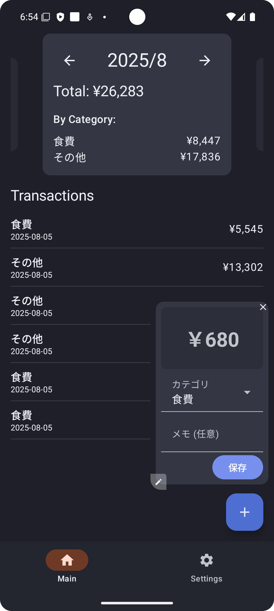

# TinyBudget

アイコンは暫定

TinyBudgetは、あなたがよく使うアプリの起動をきっかけに、サッと支出を記録できるシンプルな家計簿アプリです。
決済アプリで支払った後など、好きなタイミングで自動で起動することで面倒な家計簿付けのハードルを下げます。

## 主な機能

### 1. いつものアプリ起動で、入力画面が自動表示

PayPayや楽天ペイなどの決済アプリ、Amazonや楽天市場などのECアプリ、その他ポイントアプリなど、あなたが設定したアプリを開くと、支出入力画面が自動で表示されます。
「支払った直後」や「買い物をした直後」に記録できるので、付け忘れを防ぎます。

例えばV Pointのアプリで起動

### 2. シンプルで簡単な支出記録

表示された入力画面（オーバーレイ）は、とてもシンプル。
「金額」「カテゴリ」「メモ」を入力して保存するだけ。数秒で記録が完了します。
オーバーレイは好きな場所にドラッグして移動させ、サイズを変えることも可能です。
スワイプして金額を入力するダイアルモードと数字ボタンで入力するモードがあります。

<table>
  <tr>
    <td>ダイアルモード</td>
    <td>数字入力</td>
  </tr>
  <tr>
    <td></td>
    <td></td>
  </tr>
</table>

### 3. ひと目でわかる支出レポート

アプリ本体では、記録した支出を月ごとに確認できます。
カレンダー形式での表示で、月ごとの支出の傾向を一目で把握できます。
もちろん、記録した内容の修正や削除もいつでも簡単に行えます。

### 4. あなた好みにカスタマイズ

* **トリガーアプリ設定:** どのアプリを起動した時に支出入力画面を表示させるか、自由に選択できます。
* **カテゴリ管理:** 「食費」「交通費」などのカテゴリを、自分のライフスタイルに合わせて自由に追加・編集・削除できます。
