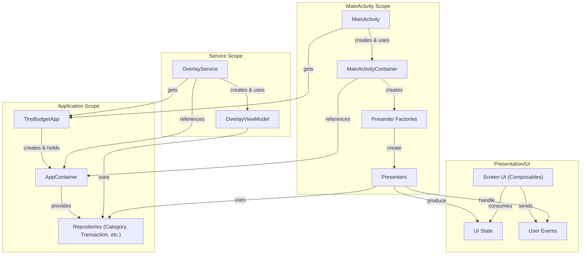

# アーキテクチャ設計書

## 概要

Circuitと手動DI（Dependency Injection）を用いた、クリーンアーキテクチャに近い構成を目指します。

### レイヤー構造

1.  **UIレイヤー (View):**
    *   **役割:** UIの表示とユーザー入力の受付。
    *   **技術:** Jetpack Compose, Circuit
    *   **パッケージ:** `io.github.arashiyama11.tinybudget.ui.*`
    *   **コンポーネント:**
        *   `CircuitScreen`: 画面の定義、状態（State）、イベント（Event）。
        *   `Composables`: 状態（State）に基づきUIを描画し、ユーザー操作をイベント（Event）としてPresenterに通知する、ステートレスな関数。

2.  **プレゼンテーションレイヤー (Presenter):**
    *   **役割:** UIロジックの担当。UIからのイベントを受け取り、データレイヤーと連携してUIの状態を更新する。
    *   **技術:** Circuit
    *   **パッケージ:** `io.github.arashiyama11.tinybudget.ui.*`
    *   **コンポーネント:**
        *   `Presenter`: `Repository`からデータを取得し、UIのための状態（State）を生成する。

3.  **データレイヤー:**
    *   **役割:** アプリケーションのデータ管理とビジネスロジック。
    *   **パッケージ:** `io.github.arashiyama11.tinybudget.data.*`
    *   **コンポーネント:**
        *   **`Repository`:**
            データソース（ローカルDB、DataStoreなど）を抽象化し、Presenterに一貫したAPIを提供する。アプリの唯一の信頼できる情報源（Single Source of Truth）。
        *   **`DataSource`:**
            *   **Local:** RoomデータベースやDataStoreとのやり取りを担当する。

4.  **サービスレイヤー:**
    *   **役割:** バックグラウンド処理。
    *   **パッケージ:** `io.github.arashiyama11.tinybudget`
    *   **コンポーネント:**
        *   `AppLaunchAccessibilityService`: 指定アプリの起動を検知する。
        *   `OverlayService`: オーバーレイUIを表示・管理する。

### 依存性注入 (DI)

手動DIのために**階層的コンテナ（Scoped Container）**アプローチを採用します。

1.  **`AppContainer` (アプリケーションスコープ):**
    *   **役割:** アプリケーション全体で共有される依存関係（`*Repository`など）を保持します。
    *   **ライフサイクル:** `Application`クラス（`TinyBudgetApp`）で生成され、アプリの生存期間中、シングルトンとして存在します。
    *   **ファイル:** `data/AppContainer.kt`

2.  **`MainActivityContainer` (Activityスコープ):**
    *   **役割:** `MainActivity`とその中のUI（CircuitのPresenter）でのみ必要となる依存関係（`Presenter.Factory`など）を保持します。
    *   **ライフサイクル:** `MainActivity`の`onCreate`で生成されます。`AppContainer`への参照を持ち、共通の依存関係はそこから取得します。
    *   **ファイル:** `ui/main/MainActivityContainer.kt`

この構成により、`OverlayService`のようなコンポーネントは、`MainActivity`専用の不要なクラス（PresenterFactoryなど）をインスタンス化することなく、`AppContainer`から必要な依存関係のみを効率的に取得できます。

### データフローと依存関係

