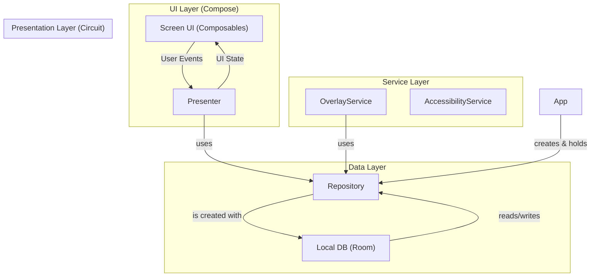

# アーキテクチャ設計書

## 概要

Circuitと手動DI（Dependency Injection）を用いた、クリーンアーキテクチャに近い構成を目指します。

### レイヤー構造

1. **UIレイヤー (View):**
    * **役割:** UIの表示とユーザー入力の受付。
    * **技術:** Jetpack Compose, Circuit
    * **コンポーネント:**
        * `CircuitScreen`: 画面の定義、状態（State）、イベント（Event）。
        * `Composables`: 状態（State）に基づきUIを描画し、ユーザー操作をイベント（Event）としてPresenterに通知する、ステートレスな関数。

2. **プレゼンテーションレイヤー (Presenter):**
    * **役割:** UIロジックの担当。UIからのイベントを受け取り、データレイヤーと連携してUIの状態を更新する。
    * **技術:** Circuit
    * **コンポーネント:**
        * `Presenter`: `Repository`からデータを取得し、UIのための状態（State）を生成する。

3. **データレイヤー:**
    * **役割:** アプリケーションのデータ管理とビジネスロジック。
    * **コンポーネント:**
        * **`Repository`:**
          データソース（ローカルDB、将来的にはリモートAPIなど）を抽象化し、Presenterに一貫したAPIを提供する。アプリの唯一の信頼できる情報源（Single
          Source of Truth）。
        * **`DataSource`:**
            * **Local:** Roomデータベースとのやり取りを担当するDAO。

4. **サービスレイヤー:**
    * **役割:** バックグラウンド処理。
    * **コンポーネント:**
        * `AccessibilityService`: 指定アプリの起動を検知する。
        * `OverlayService`: オーバーレイUIを表示・管理する。

### データフロー

