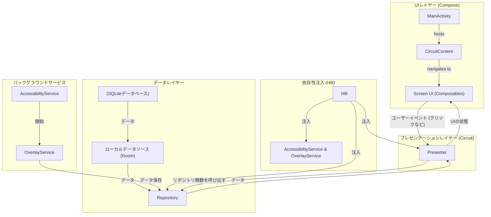

### アーキテクチャ概要

以下のコンポーネントを持つレイヤードアーキテクチャを使用します。

1.  **UIレイヤー (View):** Jetpack ComposeとCircuit。UIのレンダリングとユーザーイベントの転送を担当します。
    *   **`CircuitScreen`:** 各画面のナビゲーションルートとUIの状態/イベントモデルを定義します。
    *   **Composables:** 状態を受け取り、イベントを発行するステートレスなUIコンポーネントです。
2.  **プレゼンテーションレイヤー (Presenter):** Circuit Presenter。
    *   **`Presenter`:** UIイベントを処理し、データレイヤー（リポジトリ）と対話し、UIの状態を生成します。
3.  **データレイヤー:**
    *   **リポジトリ:** アプリのデータの単一の信頼できる情報源。データソースを抽象化し、プレゼンテーションレイヤーにクリーンなAPIを提供します。
    *   **データソース:**
        *   **ローカルデータソース:** Roomを使用してデバイスに保存されたデータを管理します。
        *   **(オプション) リモートデータソース:** クラウドバックアップ/同期などの機能のために後で追加できます。
4.  **サービス:** バックグラウンドタスク用のAndroidサービス。
    *   **`AccessibilityService`:** ターゲットアプリが起動されたことを検出します。
    *   **`OverlayService`:** トランザクションを入力するためのオーバーレイを表示します。
5.  **依存性注入:** 依存関係を管理するためのHilt。
### データフロー図

### コンポーネントの説明

1.  **`app/src/main/java/com/example/tinybudget/`**: メインのアプリケーションパッケージ。
2.  **`di/`**: `AppDatabase`、DAO、`TransactionRepository`などの依存関係を提供するためのHiltモジュール。
3.  **`data/`**:
    *   **`model/`**: データベースエンティティを表すデータクラス（`Transaction`、`Category`）を格納します。
    *   **`local/`**: Roomの`AppDatabase`クラスと、データベース操作のための`TransactionDao`および`CategoryDao`インターフェースを格納します。
    *   **`TransactionRepository.kt`**: 単一の信頼できる情報源。DAOが注入され、`addTransaction`、`getMonthlySummary`などのメソッドをプレゼンターに提供します。データソースをプレゼンテーションレイヤーから抽象化します。
4.  **`ui/`**:
    *   **`screens/`**: 各サブパッケージ（例：`home`、`settings`）はアプリの画面を表します。
        *   **`HomeScreen.kt` / `SettingsScreen.kt`**: これらのファイルは、`CircuitScreen`（ルート）、`State`データクラス、およびその画面の`Event`シールインターフェースを定義します。また、画面UIのメインのComposable関数も含まれます。
        *   **`HomePresenter.kt` / `SettingsPresenter.kt`**: これらのプレゼンターは、それぞれの画面のビジネスロジックを処理します。`TransactionRepository`が注入され、UIイベントを処理し、新しいUIの状態を発行します。
    *   **`theme/`**: 標準のJetpack Composeテーマ設定。
5.  **`services/`**:
    *   **`TransactionAccessibilityService.kt`**: ターゲットアプリがフォアグラウンドにあることを監視する`AccessibilityService`。検出されると、`OverlayService`を開始します。
    *   **`OverlayService.kt`**: `WindowManager`を使用してオーバーレイウィンドウを作成および管理する`Service`。トランザクション入力用のJetpack Compose `View`をホストします。データを保存するために`TransactionRepository`が注入されます。
6.  **`MainActivity.kt`**: UIのメインエントリポイント。`CircuitContent` Composableをホストします。
7.  **`TinyBudgetApp.kt`**: `@HiltAndroidApp`でアノテーションが付けられた`Application`クラス。
